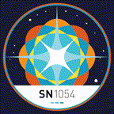

I currently work at the [OpenStapps Project](https://gitlab.com/openstapps)!

Right now I feel most at home in TypeScript, Rust and CSS and HTML.

[I also do a little motion graphics](https://www.behance.net/kiarotu), ~95% in Blender Shader Graphs!

  
  
  
  
  
  
  
  
  
  
  
  
  
  -->

